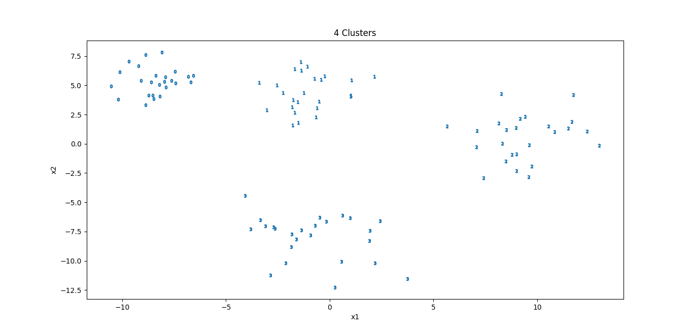
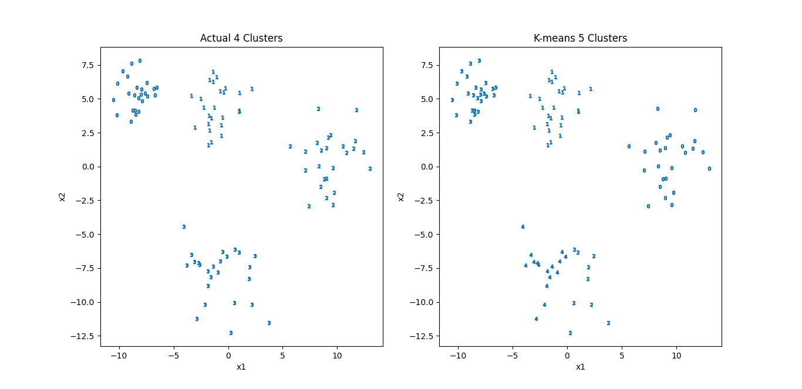

# Learning K-Means Clustering

## Table of Contents

- [Introduction](#intro)
- [Data Generation](#gen)
- [Plotting Actual Clusters](#plot)
- [K-Means Clustering](#kmeans)
- [Plotting K-Means Clustering](#plotk)

## [Introduction](#intro)

This project involves the use of K-means clustering, a popular unsupervised machine learning algorithm, to analyze and cluster synthetic data. The dataset is created using the make_blobs function from scikit-learn, generating points with four distinct clusters. The goal is to apply the K-means algorithm to cluster these data points and visualize the results.

## [Data Generation](#gen)

- The make_blobs function generates synthetic data with 100 samples, 2 features, and 4 clusters.
- The resulting data is stored in a Pandas DataFrame (df) with columns 'x1', 'x2', and 'y'.

```python
x, y = make_blobs(n_samples=100, centers=4, n_features=2, cluster_std=[1, 1.5, 2, 2], random_state=7)
df = pd.DataFrame({'x1': x[:, 0], 'x2': x[:, 1], 'y': y})
```

## [Plotting Actual Clusters](#plot)

- A custom function plot_2d_clusters is defined to visualize the actual clusters using scatter plots.
- Each cluster is represented by a unique marker ('$0$', '$1$', etc.).
- The function is then called to plot the actual clusters

```python
def plot_2d_clusters(x, y, ax):
    y_uniques = pd.Series(y).unique()
    for _ in y_uniques:
        x[y == _].plot(
            kind='scatter',
            x='x1',
            y='x2',
            marker=f'${_}$',
            ax=ax
        )
        plt.show()

fig, ax = plt.subplots(1, 1, figsize=(15, 10))
x, y = df[['x1', 'x2']], df['y']
plot_2d_clusters(x, y, ax)
```



## [K-Means Clustering](#kmeans)

- A KMeans object is created with the specified number of clusters (5 in this case).
- The fit_predict method is used to perform clustering on the data (x) and obtain cluster assignments (y_prediction).

```python
kmeans = KMeans(n_clusters=5, random_state=7)
y_prediction = kmeans.fit_predict(x)
```

## [Plotting K-Means Clustering](#plotk)

- Another set of plots is generated to visualize the clusters predicted by K-means.
- The first subplot shows the actual clusters, and the second subplot shows the clusters predicted by K-means.
- Titles are set for each subplot to indicate whether they represent actual or K-means clusters.

```python
fig, axs = plt.subplots(1, 2, figsize=(15, 10))
plot_2d_clusters(x, y, axs[0])
plot_2d_clusters(x, y_prediction, axs[1])
axs[0].set_title(f'Actual {axs[0].get_title()}')
axs[1].set_title(f'K-means {axs[1].get_title()}')
```


